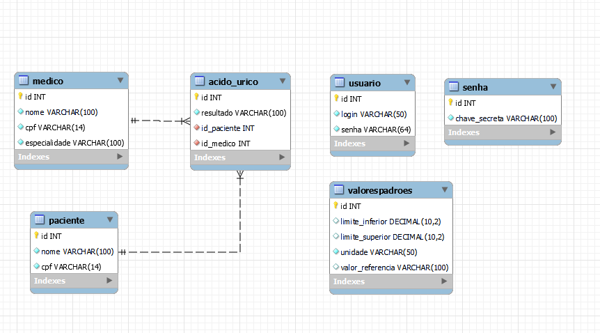

# Avaliação prática - Java e Segurança

Todos sabemos da importância dos dados de pacientes, para a privacidade do mesmo. Já tratamos este assunto em sala de aula e em avaliações teóricas. Chegamos agora a parte prática. Iremos implementar um pedaço de um sistema em Java com MySQL. Apenas o CRUD da tabela exame. Não é necessário interface gráfica. Apenas as classes que você julgar necessária e uma classe MAIN que contenha o método main para que eu possa testar a aplicação.

Requisitos:

A base de dados deverá ter as seguintes tabelas: paciente, medico,  *exame (o nome dependerá do exame)* , valorespadroes, senha e usuario. A tabela paciente terá os campos nome e cpf. A tabela medico terá os campos nome, cpf e especialidade. A tabela *exame* na verdade terá o nome do *exame *que o aluno será responsável e o tipo de dado(s) que este exame esteja relacionado. Importante frisar que **cada aluno** fará de um tipo de **exame** diferente. Não cabendo dois alunos na mesma turma escolher o mesmo tipo. A lista dos exames disponíveis será informada no final deste enunciado. A tabela usuário terá o login e a senha, armazenada em [HASH](https://academico.rj.senac.br/mod/folder/view.php?id=39216 "HASH") SHA 128.

A tabela do exame estará criptograda com algoritmo DES.

A tabela senha terá um campo que será a chave secreta utilizada para criptografar a tabela exame.

A tabela senha será criptografada com a senha do usuário. **Não será com o [HASH](https://academico.rj.senac.br/mod/folder/view.php?id=39216 "HASH") da senha.**

O aluno deverá, com as informações prestadas, aplicar as técnicas de criptografia necessárias para que os níveis de segurança adequados sejam aplicados.

A tabela valorespadroes irão armazenar os valores limites do exame, a unidade utilizada e os valores de referência.

Tipos de exames - **apenas um por aluno. O mesmo irá informar qual exame escolheu. No meu caso o exame escolhido foi Acido Urico.**

# Diagrama do banco de dados

# Organização do projeto

Na raiz do projeto se encontra o arquivo Criacao de tabelas.sql, rode o mesmo no seu servidor Mysql/MariaDB para criar as tabelas relativas ao diagrama acima e popular as tabelas paciente, medico e valorespadroes. 

A lib de comunicação com o banco de dados MariaDB utilizado foi a mariadb-java-client-3.2.0.jar

Na pasta src se encontra todo o código Java dividido em pacotes.

No pacote testes, estão duas classes responsaveis por realizar os testes , com metodos main, a TestePopula e A TesteSelectEDecriptografa. Execute primeiro a TestePopula para popular o banco de dados, relativos as tabelas acido_urico, usuario e senha. E depois a TesteSelectEDecriptografa, para verificar como os dados foram salvos no banco e a sua decriptografia, caso queira ter acesso novamente as dados.

O pacote javaDB possui a classe responsável por realizar a conexão com o banco de dados, caso necessario faça alterações no usuario e na senha para a correta comunicação com o seu banco de dados.

No pacote segurança estão as duas classes Criptografia e Hash, responsáveis como o próprio nome diz pelos algoritmos de Criptografia e Hash.
